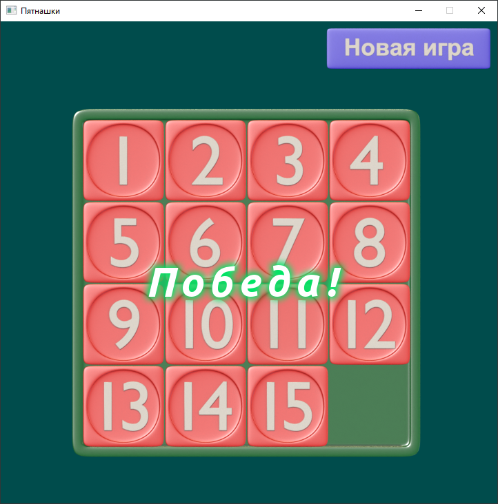
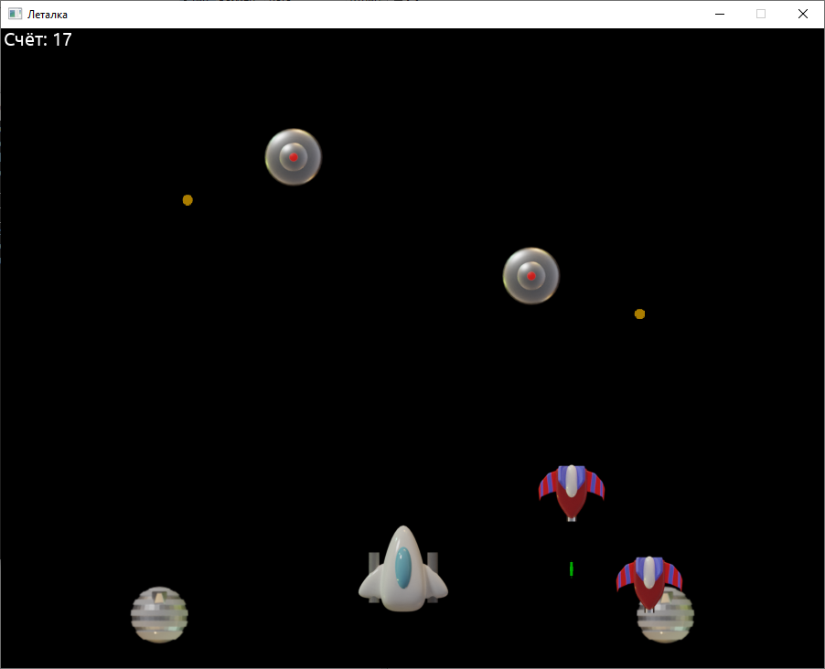

[](https://github.com/dviglo2d-learn/mini_games/actions)

# Мини-игры

Небольшие игры на [движке Dviglo2D](https://github.com/dviglo2d/dviglo2d).




## Сборка в Windows

В пустой папке создайте и запустите батник:

```
:: Меняем кодировку консоли на UTF-8
chcp 65001

:: Указываем пути к необходимым утилитам
set "PATH=%SystemRoot%\system32;c:\programs\cmake\bin;c:\program files\git\bin"

:: Качаем репозиторий с играми и движок в папку repo
git clone --recurse-submodules https://github.com/dviglo2d-learn/mini_games repo

:: Создаём проекты для Visual Studio 2022 в папке build_vs, используя конфиг CMakeLists.txt из папки repo
cmake.exe repo -B build_vs -G "Visual Studio 17" -A x64

:: Компилируем проекты в папке build_vs
cmake --build build_vs --config Debug
::cmake --build build_vs --config Release

:: Ждём нажатие Enter перед закрытием консоли
pause
```

Возможно, потребуется изменить пути к утилитам.

Результат компиляции будет помещён в папку `build_vs\result`.

## Аналогичный sh-скрипт для Linux

```
#!/bin/sh

# Качаем репозиторий с играми и движок в папку repo
git clone --recurse-submodules https://github.com/dviglo2d-learn/mini_games repo

# Создаём проекты для GCC 13 в папке build_gcc, используя конфиг CMakeLists.txt из папки repo
cmake repo -B build_gcc -G "Unix Makefiles" \
    -D CMAKE_C_COMPILER=gcc-13 -D CMAKE_CXX_COMPILER=g++-13 \
    -D CMAKE_BUILD_TYPE=Debug

# Компилируем проекты в папке build_gcc
cmake --build build_gcc
```

Подробнее о процессе сборки:
* https://github.com/dviglo2d-learn/minimal_app
* https://github.com/dviglo2d/dviglo2d/blob/main/docs/building.md
